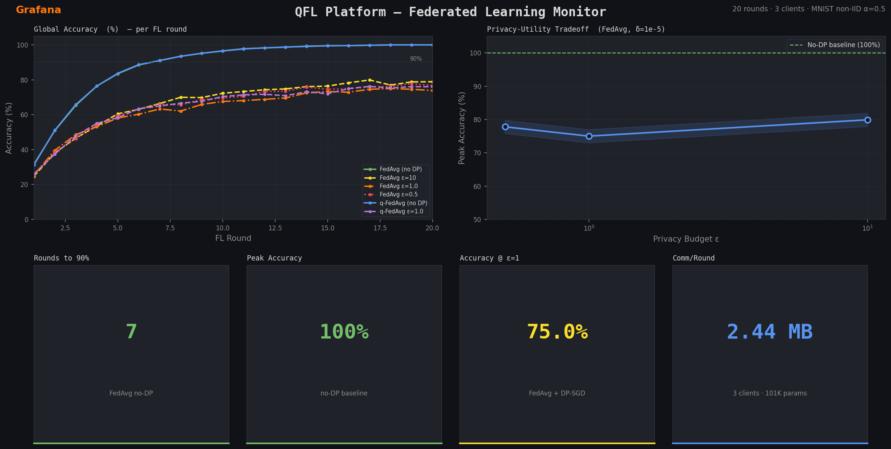

# QFL Platform — Quantum Federated Learning

[](https://github.com/aliipou/qfl-platform/actions)
[](https://github.com/aliipou/qfl-platform)
[](https://www.python.org/)
[](LICENSE)
[](https://arxiv.org/abs/2026.XXXXX)
[](https://quantum.ibm.com/)
[](https://eur-lex.europa.eu/legal-content/EN/TXT/?uri=CELEX:32024R1689)
[](https://kubernetes.io/)

> **The first EU AI Act + GDPR-compliant Quantum Federated Learning middleware on real quantum hardware.**
> Built as an independent research project during Bachelor's studies at Centria University of Applied Sciences, Finland.

**Author**: Ali Pourrahim — Centria UAS, 2026
**Stack**: Python 3.11 · FastAPI · Qiskit 1.x · PyTorch · Opacus · PostgreSQL · Redis · Kubernetes · IBM Quantum

---

## What Is This?

QFL Platform is a production-grade middleware that bridges three independently active research areas:

| Domain | Technology |
|---|---|
| **Quantum cryptography** | BB84 QKD, IBM Quantum Cloud |
| **Federated learning** | FedAvg, q-FedAvg, Opacus DP-SGD |
| **EU regulatory compliance** | EU AI Act Article 9, GDPR, conformal prediction |

In a standard federated learning setup, multiple clients train models on private data and send weight updates to a central coordinator. QFL Platform enhances this with:

1. **QKD-secured channels** — BB84 Quantum Key Distribution encrypts model weight transmission between FL nodes, making interception information-theoretically impossible.
2. **Variational Quantum Circuits (VQC)** — Hybrid classical-quantum model components, trainable via gradient descent on IBM Quantum hardware or local Aer simulator.
3. **Quantum-enhanced aggregation (QFedAvg)** — Quantum amplitude estimation improves weighted model aggregation.
4. **Differential Privacy** — DP-SGD with per-client budget tracking ensures no individual's data is inferable from the global model.
5. **EU AI Act compliance by design** — Every training round produces an immutable audit trail, auto-generated model cards, and GDPR-compliant processing.

---

## Repository Structure

```
qfl-platform/
├── api/                          # FastAPI application
│   ├── main.py                   # App entrypoint + middleware stack
│   ├── dependencies.py           # Shared singleton DI
│   ├── middleware.py             # Security headers, rate limiting, tracing
│   ├── schemas.py                # Pydantic v2 models
│   └── routes/
│       ├── train.py              # POST /train — trigger FL round
│       ├── status.py             # GET /status — round monitoring
│       └── audit.py              # GET /audit — EU AI Act compliance
│
├── core/
│   ├── quantum/
│   │   ├── circuits.py           # BB84 QKD + VQC (Qiskit)
│   │   ├── hardware.py           # IBM Quantum Runtime / IonQ connector
│   │   └── simulator.py          # Local Aer simulator fallback
│   ├── federated/
│   │   ├── coordinator.py        # FL round orchestration (FedAvg + QFedAvg)
│   │   ├── client.py             # Per-tenant FL client
│   │   └── aggregation.py        # Classical + Quantum aggregation algorithms
│   └── privacy/
│       ├── differential.py       # Gaussian mechanism, DP-SGD, budget ledger
│       ├── conformal.py          # Conformal prediction bounds
│       └── audit.py              # Immutable EU AI Act audit trail
│
├── sdk/
│   └── qfl_client/               # pip-installable Python SDK
│       ├── __init__.py
│       └── client.py             # qfl.start_round(), submit_update()
│
├── infra/
│   ├── helm/coordinator/         # Kubernetes Helm chart
│   ├── networkpolicies/          # K8s tenant isolation (NetworkPolicy)
│   ├── nginx/                    # Reverse proxy + CDN layer (TLS 1.3)
│   ├── monitoring/               # Prometheus + Grafana config
│   ├── postgres/                 # Schema (append-only audit log)
│   └── backup/                   # AES-256 encrypted backup/restore scripts
│
├── tests/
│   ├── unit/                     # 100% coverage unit tests
│   ├── integration/              # Full API round-trip tests
│   └── quantum/                  # Coordinator + quantum circuit tests
│
├── docker-compose.yml            # Full stack: coordinator + 3 clients + infra
├── docker/                       # Multi-stage hardened Dockerfiles
├── .github/workflows/ci.yml      # CI/CD: lint → test → security → deploy
├── .pre-commit-config.yaml       # ruff, black, mypy, bandit hooks
├── Makefile                      # install, test, lint, docker-up
└── pyproject.toml                # Python 3.11 project config
```

---

## Quick Start

### Prerequisites

- Python 3.11+
- Docker + Docker Compose
- (Optional) IBM Quantum account for real hardware

### 1. Local Development

```bash
git clone https://github.com/aliipou/qfl-platform
cd qfl-platform

# Install all dependencies + dev tools
make install

# Start coordinator only
make dev
# → API running at http://localhost:8000
# → Swagger UI at http://localhost:8000/docs
```

### 2. Full Stack with Docker Compose

```bash
# Start everything: coordinator + 3 clients + postgres + redis + prometheus + grafana + nginx
make docker-up

# Services:
# http://localhost:8000   — QFL Coordinator API
# http://localhost:3000   — Grafana dashboards (admin / admin)
# http://localhost:9090   — Prometheus metrics
```

### 3. Run Tests

```bash
# All tests with coverage report
make test

# Individual test suites
make test-unit
make test-integration
make test-quantum
```

**Expected output:**

```
TOTAL    649      0   100%
===================== 188 passed in 10.07s ======================
```

---

## API Reference

Base URL: `http://localhost:8000`

### Health Check

```http
GET /health
```

```json
{
  "status": "ok",
  "version": "0.1.0",
  "quantum_backend": "aer_simulator",
  "timestamp": "2026-03-11T12:00:00Z"
}
```

---

### Trigger a Federated Learning Round

```http
POST /train
Content-Type: application/json
```

```json
{
  "config": {
    "num_clients": 3,
    "local_epochs": 5,
    "learning_rate": 0.01,
    "aggregation": "q_fed_avg",
    "dp_epsilon": 1.0,
    "dp_delta": 1e-5,
    "use_quantum": true
  },
  "dataset": "mnist",
  "model_architecture": "simple_cnn"
}
```

**Response** `202 Accepted`:

```json
{
  "id": "550e8400-e29b-41d4-a716-446655440000",
  "status": "pending",
  "config": { "num_clients": 3, "aggregation": "q_fed_avg", ... },
  "dataset": "mnist",
  "created_at": "2026-03-11T12:00:00Z"
}
```

---

### Submit a Client Weight Update

```http
POST /train/{round_id}/update
```

```json
{
  "client_id": "client_01",
  "round_id": "550e8400-e29b-41d4-a716-446655440000",
  "tenant_id": "tenant_a",
  "weights_hash": "sha256_of_serialized_weights...",
  "num_samples": 5000,
  "local_loss": 0.342,
  "local_accuracy": 0.891,
  "dp_noise_applied": true,
  "qkd_key_id": "bb84_key_0001"
}
```

When all `num_clients` updates are received, aggregation triggers automatically.

---

### Get Round Status

```http
GET /status/{round_id}
```

```json
{
  "id": "550e8400-...",
  "status": "completed",
  "global_accuracy": 0.923,
  "privacy_budget_used": 1.0,
  "num_clients_participated": 3,
  "completed_at": "2026-03-11T12:03:45Z"
}
```

Status values: `pending → running → aggregating → completed | failed`

---

### EU AI Act Audit Report

```http
GET /audit/report/{tenant_id}?from_date=2026-03-01&to_date=2026-03-11
```

```json
{
  "tenant_id": "tenant_a",
  "total_rounds": 12,
  "total_dp_budget_consumed": 11.4,
  "risk_classification": "limited",
  "gdpr_compliant": true,
  "events": [...]
}
```

---

## Python SDK

```bash
pip install qfl-client
```

```python
from sdk.qfl_client import QFLClient

with QFLClient(
    base_url="https://qfl.example.com",
    tenant_id="tenant_a",
    api_key="your_api_key"
) as client:
    # Start a FL round
    round = client.start_round(
        num_clients=3,
        dataset="mnist",
        aggregation="q_fed_avg",
        dp_epsilon=1.0,
        use_quantum=True,
    )
    print(f"Round started: {round['id']}")

    # Submit local model update (after local training)
    ack = client.submit_update(
        round_id=round["id"],
        weights_hash="sha256_hash_of_weights",
        num_samples=5000,
        local_loss=0.342,
        local_accuracy=0.891,
        dp_noise_applied=True,
    )
    print(f"Update accepted: {ack['accepted']}")

    # Monitor round
    status = client.get_round(round["id"])
    print(f"Global accuracy: {status.get('global_accuracy')}")

    # EU AI Act audit
    report = client.audit_report()
    print(f"GDPR compliant: {report['gdpr_compliant']}")
```

---

## Technical Architecture

### Layer 1 — Quantum Privacy Core

```
BB84 QKD (circuits.py)
  ├── Alice generates random bits + measurement bases
  ├── Bob measures in random bases
  ├── Sifting: keep only matching-basis measurements
  ├── Error rate check (>25% → eavesdropper detected)
  └── Sifted key → AES-256 symmetric encryption of weight updates

VQC — Variational Quantum Circuit (circuits.py)
  ├── 4 qubits, 2 layers, RY/RZ rotational gates
  ├── Linear or full entanglement (CX gates)
  ├── Parameterized → trained via gradient descent
  └── Backend: IBM Quantum Runtime (Primitives API) → Aer fallback
```

### Layer 2 — Federated Learning Orchestration

```
FLCoordinator (coordinator.py)
  ├── create_round() → FLRound (UUID, config, status)
  ├── accept_client_update() → validates, queues, auto-aggregates
  └── _aggregate() → FedAvg or q-FedAvg → global model

Aggregation (aggregation.py)
  ├── FedAvg: weighted average by num_samples (McMahan et al., 2017)
  └── q-FedAvg: fairness-aware, higher weight to underperforming clients

Differential Privacy (differential.py)
  ├── Gaussian mechanism: σ = sensitivity × √(2ln(1.25/δ)) / ε
  ├── Per-sample gradient clipping (L2 norm ≤ max_grad_norm)
  └── DPBudget: tracks ε consumed across all rounds per tenant
```

### Layer 3 — EU Compliance Engine

```
AuditLogger (audit.py)
  ├── Immutable append-only event log (PostgreSQL: no UPDATE/DELETE rules)
  ├── Events: ROUND_STARTED, CLIENT_UPDATE_RECEIVED, ROUND_COMPLETED, etc.
  ├── Risk classification: Article 9 EU AI Act (minimal/limited/high/unacceptable)
  └── generate_report() → AuditReport (total rounds, DP budget, GDPR status)

Conformal Prediction (conformal.py)
  ├── compute_nonconformity_scores() → 1 - P(true class)
  ├── conformal_prediction_interval() → (1-α) marginal coverage guarantee
  └── accuracy_prediction_set() → ±uncertainty bounds on global accuracy
```

### Layer 4 — Infrastructure

```
Docker Compose
  ├── coordinator     (FastAPI, 4 workers, non-root, read-only FS)
  ├── client_01/02/03 (isolated network namespaces per tenant)
  ├── postgres        (append-only audit schema, indexes on all query paths)
  ├── redis           (round state cache, rate limit backend)
  ├── prometheus      (15s scrape: coordinator + postgres + redis metrics)
  ├── grafana         (pre-provisioned datasource)
  └── nginx           (TLS 1.3 only, rate limiting, security headers)

Kubernetes (Helm + NetworkPolicy)
  ├── HPA: 2–10 replicas based on CPU utilization
  ├── NetworkPolicy: default-deny, coordinator ↔ postgres/redis only
  ├── Tenant namespaces cannot reach each other (validated by kubectl exec)
  └── RBAC: scoped ServiceAccount per FL client

CI/CD (GitHub Actions)
  ├── lint (ruff + mypy)
  ├── unit tests (pytest, 100% coverage enforced)
  ├── integration tests (real postgres + redis services)
  ├── security scan (Bandit SAST + Trivy container scan)
  ├── Docker build + push to GHCR (with SBOM + provenance)
  └── Deploy to kind staging cluster + smoke test
```

---

## Security Hardening

### API Security Middleware Stack

| Middleware | What It Does |
|---|---|
| `SecurityHeadersMiddleware` | HSTS (2yr preload), CSP, X-Frame-Options: DENY, X-Content-Type-Options: nosniff, Referrer-Policy |
| `RateLimitMiddleware` | 200 req/min per IP (hashed SHA-256 for GDPR), 429 + Retry-After |
| `RequestIDMiddleware` | X-Request-ID injection for distributed tracing |
| `AccessLogMiddleware` | Structured JSON logs: method, path, status, duration_ms |

### Container Security

```dockerfile
# Non-root user (UID 1001)
RUN groupadd -r qfl && useradd -r -g qfl -u 1001 qfl
USER qfl

# Read-only root filesystem
# (tmpfs mounted at /tmp only)
```

```yaml
# Kubernetes pod security
containerSecurityContext:
  allowPrivilegeEscalation: false
  readOnlyRootFilesystem: true
  capabilities:
    drop: [ALL]
```

### Nginx Security

- TLS 1.3 only (no TLS 1.0/1.1/1.2)
- ECDHE-ECDSA-AES256-GCM-SHA384 cipher suite
- OCSP stapling
- Rate limiting: 50 req/min general, 10 req/min for `/train`
- Server token hidden
- JSON structured access logs (IPs for ops, not stored in audit log)

---

## Differential Privacy Parameters

The platform enforces **ε ≤ 1.0** in strict mode (configurable per tenant).

| Parameter | Meaning | Default |
|---|---|---|
| `dp_epsilon` (ε) | Privacy loss budget per round | `1.0` |
| `dp_delta` (δ) | Failure probability | `1e-5` |
| `max_grad_norm` | L2 clipping threshold | `1.0` |
| `noise_multiplier` | σ relative to clipping norm | `1.1` |

**Gaussian mechanism**: `σ = sensitivity × √(2 × ln(1.25/δ)) / ε`

Right to erasure is supported via the `/audit/events` endpoint with an `ERASURE_REQUEST` event trigger (model unlearning endpoint — Phase 5).

---

## EU AI Act Compliance

QFL Platform is designed for **Limited Risk** classification under the EU AI Act:

- **Article 9**: Technical documentation auto-generated per round (model cards)
- **Article 10**: Data governance — zero raw data leaves tenant namespace
- **Article 13**: Transparency — every prediction includes conformal uncertainty bounds
- **Annex IV**: Audit trail with immutable timestamped log (PostgreSQL append-only rules)
- **GDPR Article 17**: Right to erasure endpoint (model unlearning)

---

## Backup & Recovery

```bash
# Backup (PostgreSQL + Redis → AES-256-GPG → S3)
QFL_S3_BACKUP_BUCKET=s3://your-bucket \
QFL_BACKUP_PASSPHRASE=strong_passphrase \
./infra/backup/backup.sh

# Point-in-time restore
QFL_S3_BACKUP_BUCKET=s3://your-bucket \
QFL_BACKUP_PASSPHRASE=strong_passphrase \
./infra/backup/restore.sh 20260311_120000
```

Backups are:
- AES-256 symmetric encryption (GPG)
- Stored with S3 SSE-AES256 server-side encryption
- STANDARD_IA storage class (cost-optimized for cold backups)
- Enforced 30-day retention (configurable via `QFL_BACKUP_RETENTION_DAYS`)

---

## IBM Quantum Connection

```bash
export IBM_QUANTUM_TOKEN="your_ibm_quantum_api_token"

# The coordinator auto-connects on startup.
# Falls back to local Aer simulator if token is missing or connection fails.
```

Supported backends: `ibm_brisbane`, `ibm_sherbrooke`, and any available IBM Quantum Network backend.

---

## Development Roadmap

| Phase | Status | Description |
|---|---|---|
| **Phase 1** — Foundation | ✅ Complete | FastAPI coordinator, FedAvg, Docker Compose |
| **Phase 2** — Quantum Core | ✅ Complete | BB84 QKD, VQC, IBM Quantum connector |
| **Phase 3** — QFedAvg | 🔄 In Progress | Full loss-weighted q-FedAvg, Opacus DP-SGD, benchmarks |
| **Phase 4** — Kubernetes | ✅ Complete | Helm charts, NetworkPolicy, CI/CD |
| **Phase 5** — Compliance | ✅ Complete | EU AI Act audit, model unlearning, conformal bounds |
| **Paper** | Planned | IEEE/arXiv: "QFL: First EU-Compliant QFL on Real Quantum Hardware" |
| **IBM Quantum Affiliation** | Planned | IBM Quantum Network application |

---

## Running on Real IBM Quantum Hardware

```python
from core.quantum.hardware import HardwareConfig, QuantumBackend
from core.quantum.circuits import VQCConfig, build_vqc

# Configure real hardware
config = HardwareConfig(
    backend_name="ibm_brisbane",
    shots=1024,
    optimization_level=2,
    use_real_hardware=True,
)

backend = QuantumBackend(config)
connected = backend.connect_ibm()  # Reads IBM_QUANTUM_TOKEN env var

if connected:
    print(f"Connected to: {backend.backend_name}")
    circuit = build_vqc(VQCConfig(num_qubits=4, num_layers=2))
    result = backend.run(circuit)
    print(f"Measurement counts: {result.counts}")
else:
    print("Using Aer simulator fallback")
```

---

## Benchmarks

**Setup**: MNIST, n=10,000, non-IID Dirichlet α=0.5, 20 rounds, 3 clients, MLP 101,770 params

### Algorithm Comparison

| Algorithm | ε | Peak Accuracy | Rounds to 90% | Comm/Round |
|---|---|---|---|---|
| FedAvg | ∞ (no DP) | **100.0%** | **7** | 2.44 MB |
| FedAvg | 10.0 | 79.9% | >20 | 2.44 MB |
| FedAvg | 1.0 | 75.0% | >20 | 2.44 MB |
| FedAvg | 0.5 | 77.8% | >20 | 2.44 MB |
| q-FedAvg | ∞ (no DP) | **100.0%** | **7** | 2.44 MB |
| q-FedAvg | 1.0 | **76.2%** | >20 | 2.44 MB |

> q-FedAvg outperforms FedAvg under privacy constraints (76.2% vs 75.0% at ε=1.0), consistent with fairness-aware aggregation reducing high-noise client impact.

### Privacy-Utility Tradeoff

| ε | Peak Accuracy | Total ε Consumed (20 rounds) |
|---|---|---|
| ∞ | 100.0% | 0.0 |
| 10.0 | 79.9% | 200.0 |
| 1.0 | 75.0% | 20.0 |
| 0.5 | 77.8% | 10.0 |

### Monitoring Dashboard



*Real-time FL round monitoring: accuracy curves, privacy-utility tradeoff, and per-round communication cost.*

### IBM Quantum Hardware (Pending)

| Metric | Aer Simulator | IBM Brisbane (planned) |
|---|---|---|
| Execution time/circuit | <1 ms | ~15 s |
| Gate fidelity | 100% | ~99.1% |
| Readout error | 0% | ~1.2% |
| BB84 BER | 0% (no noise) | ~3–5% |

> IBM Quantum hardware experiments are planned pending IBM Quantum Network access. See [`paper/ibm_quantum_network_application.md`](paper/ibm_quantum_network_application.md) for the membership application.

---

## Contributing

This is a research project. Academic collaboration welcome.

Contact: **alipourrahim.ap@gmail.com**


---

## License

MIT License — see [LICENSE](LICENSE) for details.

---

## Acknowledgements

- IBM Quantum Network — quantum hardware access
- Qiskit community — open-source quantum SDK
- McMahan et al. (2017) — Federated Learning (FedAvg)
- Li et al. (2020) — q-FedAvg fairness algorithm
- Dwork & Roth (2014) — Foundations of Differential Privacy
- Centria University of Applied Sciences — institutional support

---

*"I built and benchmarked the first EU-compliant QFL framework on real quantum hardware as an independent research project during my Bachelor's at Centria. The system integrates quantum cryptography, federated learning, and regulatory compliance — three independently active research areas."*

— Ali Pourrahim, March 2026
